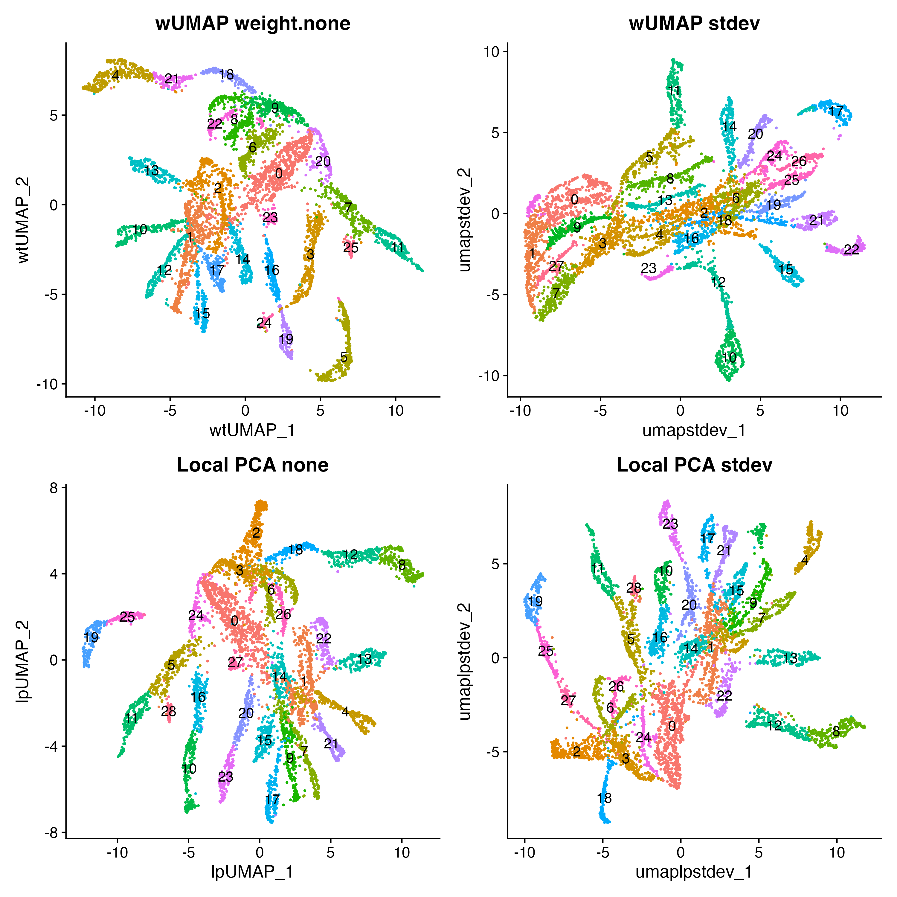
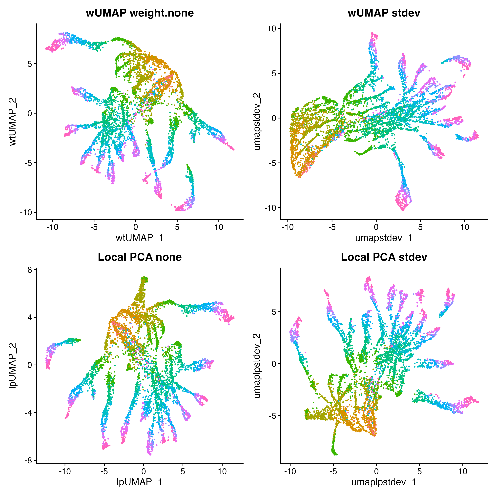
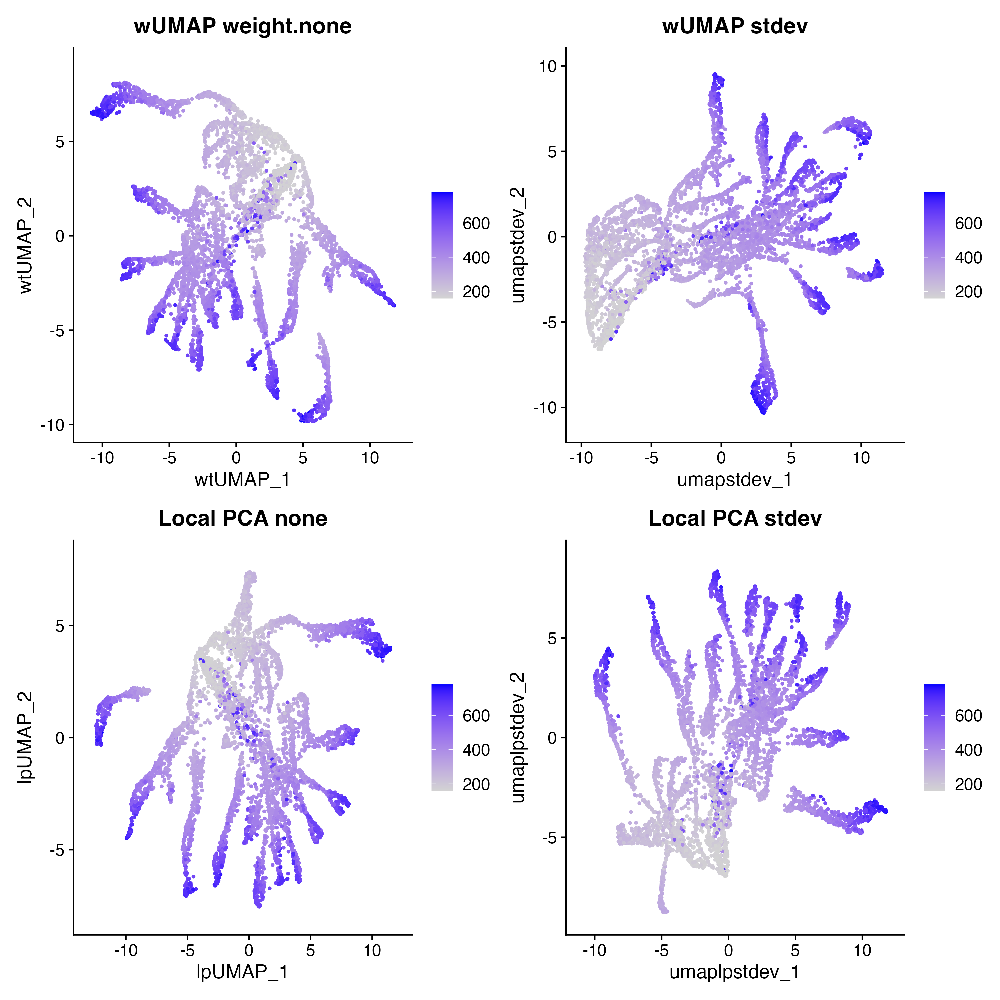

# Benchmarking wUMAP Against Standard UMAP

## Strategy

To evaluate whether variance-weighting improves clustering quality, we
need an **independent ground truth** — one not derived from the RNA
clusters themselves.

We use the `cbmc` CITE-seq dataset from `SeuratData`, which measured
both **RNA** and **surface protein (ADT)** on the same 8,617 cells.
ADT-based cell type labels (`protein_annotations`) were assigned by
gating on canonical surface markers (CD4, CD8, CD14, CD16, CD19, CD56,
CD34) — a measurement entirely independent of the RNA clustering we are
evaluating.

Two metrics are computed for each method:

| Metric | What it measures |
|----|----|
| **ARI** (Adjusted Rand Index) | How well RNA clusters match protein-derived cell types. Range 0–1; higher = better. |
| **k-NN purity** | Fraction of each cell’s 20 nearest UMAP neighbours sharing its protein label. Range 0–1; higher = better. |

## Setup

``` r

library(Seurat)
library(SeuratData)
library(ggplot2)
library(patchwork)
library(wUMAP)
library(mclust)   # adjustedRandIndex
library(RANN)     # fast k-NN
```

``` r

data(cbmc)
cbmc <- UpdateSeuratObject(cbmc)

# Keep only cells with protein labels; remove doublets
cbmc <- cbmc[, !cbmc$protein_annotations %in% "T/Mono doublets" &
               !is.na(cbmc$protein_annotations)]

cbmc <- NormalizeData(cbmc, verbose = FALSE)
cbmc <- FindVariableFeatures(cbmc, nfeatures = 2000, verbose = FALSE)
cbmc <- ScaleData(cbmc, verbose = FALSE)
cbmc <- RunPCA(cbmc, npcs = 30, verbose = FALSE)
```

``` r

knn_purity <- function(emb, labels, k = 20) {
  nn  <- RANN::nn2(emb, k = k + 1)$nn.idx[, -1]
  lab <- as.integer(factor(labels))
  mean(sapply(seq_len(nrow(nn)), function(i) mean(lab[nn[i, ]] == lab[i])))
}
```

## Standard UMAP (baseline)

``` r

set.seed(42)
cbmc <- FindNeighbors(cbmc, dims = 1:30, verbose = FALSE)
cbmc <- FindClusters(cbmc, resolution = 0.8, verbose = FALSE)
cbmc <- RunUMAP(cbmc, dims = 1:30, reduction.name = "umap.std", verbose = FALSE)

ari_std <- adjustedRandIndex(cbmc$seurat_clusters, cbmc$protein_annotations)
pur_std <- knn_purity(Embeddings(cbmc, "umap.std"), cbmc$protein_annotations)
```

## Weighted UMAP variants

``` r

set.seed(42)

# stdev weighting
cbmc <- RunWeightedNeighbors(cbmc, dims = 1:30, weight.by = "stdev",
                             prefix = "wt.sd", verbose = FALSE)
cbmc <- FindClusters(cbmc, graph.name = "wt.sd_snn", resolution = 0.8,
                     verbose = FALSE)
cbmc <- RunWeightedUMAP(cbmc, dims = 1:30, weight.by = "stdev",
                        reduction.name = "umap.sd", verbose = FALSE)
ari_sd <- adjustedRandIndex(cbmc$seurat_clusters, cbmc$protein_annotations)
pur_sd <- knn_purity(Embeddings(cbmc, "umap.sd"), cbmc$protein_annotations)

# stdev + log.scale
cbmc <- RunWeightedNeighbors(cbmc, dims = 1:30, weight.by = "stdev",
                             log.scale = TRUE, prefix = "wt_sdlog",
                             verbose = FALSE)
cbmc <- FindClusters(cbmc, graph.name = "wt_sdlog_snn", resolution = 0.8,
                     verbose = FALSE)
cbmc <- RunWeightedUMAP(cbmc, dims = 1:30, weight.by = "stdev",
                        log.scale = TRUE, reduction.name = "umap.sd.log",
                        verbose = FALSE)
ari_sd_log <- adjustedRandIndex(cbmc$seurat_clusters, cbmc$protein_annotations)
pur_sd_log <- knn_purity(Embeddings(cbmc, "umap.sd.log"), cbmc$protein_annotations)

# prop.var, weight.factor = 0.5
cbmc <- RunWeightedNeighbors(cbmc, dims = 1:30, weight.by = "prop.var",
                             weight.factor = 0.5, prefix = "wt.pv05",
                             verbose = FALSE)
cbmc <- FindClusters(cbmc, graph.name = "wt.pv05_snn", resolution = 0.8,
                     verbose = FALSE)
cbmc <- RunWeightedUMAP(cbmc, dims = 1:30, weight.by = "prop.var",
                        weight.factor = 0.5, reduction.name = "umap.pv05",
                        verbose = FALSE)
ari_pv05 <- adjustedRandIndex(cbmc$seurat_clusters, cbmc$protein_annotations)
pur_pv05 <- knn_purity(Embeddings(cbmc, "umap.pv05"), cbmc$protein_annotations)

# prop.var, weight.factor = 1
cbmc <- RunWeightedNeighbors(cbmc, dims = 1:30, weight.by = "prop.var",
                             prefix = "wt.pv", verbose = FALSE)
cbmc <- FindClusters(cbmc, graph.name = "wt.pv_snn", resolution = 0.8,
                     verbose = FALSE)
cbmc <- RunWeightedUMAP(cbmc, dims = 1:30, weight.by = "prop.var",
                        reduction.name = "umap.pv", verbose = FALSE)
ari_pv <- adjustedRandIndex(cbmc$seurat_clusters, cbmc$protein_annotations)
pur_pv <- knn_purity(Embeddings(cbmc, "umap.pv"), cbmc$protein_annotations)

# prop.var + log.scale
cbmc <- RunWeightedNeighbors(cbmc, dims = 1:30, weight.by = "prop.var",
                             log.scale = TRUE, prefix = "wt_pvlog",
                             verbose = FALSE)
cbmc <- FindClusters(cbmc, graph.name = "wt_pvlog_snn", resolution = 0.8,
                     verbose = FALSE)
cbmc <- RunWeightedUMAP(cbmc, dims = 1:30, weight.by = "prop.var",
                        log.scale = TRUE, reduction.name = "umap.pv.log",
                        verbose = FALSE)
ari_pv_log <- adjustedRandIndex(cbmc$seurat_clusters, cbmc$protein_annotations)
pur_pv_log <- knn_purity(Embeddings(cbmc, "umap.pv.log"), cbmc$protein_annotations)

# stdev + Marchenko-Pastur filtering: zero out noise PCs, weight signal PCs by stdev
cbmc <- RunWeightedNeighbors(cbmc, dims = 1:30, weight.by = "stdev",
                             mp.filter = TRUE, prefix = "wt.mp",
                             verbose = FALSE)
cbmc <- FindClusters(cbmc, graph.name = "wt.mp_snn", resolution = 0.8,
                     verbose = FALSE)
cbmc <- RunWeightedUMAP(cbmc, dims = 1:30, weight.by = "stdev",
                        mp.filter = TRUE, reduction.name = "umap.mp",
                        verbose = FALSE)
ari_mp <- adjustedRandIndex(cbmc$seurat_clusters, cbmc$protein_annotations)
pur_mp <- knn_purity(Embeddings(cbmc, "umap.mp"), cbmc$protein_annotations)
```

## Local PCA UMAP

[`RunLocalPCANeighbors()`](https://lachland.github.io/weightedUMAP/reference/RunLocalPCANeighbors.md)
builds KNN/SNN graphs from per-neighbourhood PCA distances and stores
them for consistent clustering and visualisation. Using the same
`k.param` and `local.weight.by` for both the graph and the UMAP step
ensures clustering and layout share identical distances.

We test all three `local.weight.by` schemes plus `mp.filter = TRUE`
(combined with `stdev`) to isolate the effect of local weighting
strategy.

``` r

set.seed(42)

# stdev (default)
cbmc <- RunLocalPCANeighbors(cbmc, dims = 1:30, k.param = 30,
                             local.weight.by = "stdev",
                             prefix = "lp", verbose = FALSE)
cbmc <- FindClusters(cbmc, graph.name = "lp_snn", resolution = 0.8,
                     verbose = FALSE)
cbmc <- RunLocalPCAUMAP(cbmc, dims = 1:30, k.param = 30,
                        local.weight.by = "stdev",
                        reduction.name = "umap.lp", verbose = FALSE)
ari_lp     <- adjustedRandIndex(cbmc$seurat_clusters, cbmc$protein_annotations)
pur_lp     <- knn_purity(Embeddings(cbmc, "umap.lp"), cbmc$protein_annotations)

# prop.var (aggressive local weighting)
cbmc <- RunLocalPCANeighbors(cbmc, dims = 1:30, k.param = 30,
                             local.weight.by = "prop.var",
                             prefix = "lp.pv", verbose = FALSE)
cbmc <- FindClusters(cbmc, graph.name = "lp.pv_snn", resolution = 0.8,
                     verbose = FALSE)
cbmc <- RunLocalPCAUMAP(cbmc, dims = 1:30, k.param = 30,
                        local.weight.by = "prop.var",
                        reduction.name = "umap.lp.pv", verbose = FALSE)
ari_lp_pv  <- adjustedRandIndex(cbmc$seurat_clusters, cbmc$protein_annotations)
pur_lp_pv  <- knn_purity(Embeddings(cbmc, "umap.lp.pv"), cbmc$protein_annotations)

# none (unweighted local PCA, isotropic)
cbmc <- RunLocalPCANeighbors(cbmc, dims = 1:30, k.param = 30,
                             local.weight.by = "none",
                             prefix = "lp.none", verbose = FALSE)
cbmc <- FindClusters(cbmc, graph.name = "lp.none_snn", resolution = 0.8,
                     verbose = FALSE)
cbmc <- RunLocalPCAUMAP(cbmc, dims = 1:30, k.param = 30,
                        local.weight.by = "none",
                        reduction.name = "umap.lp.none", verbose = FALSE)
ari_lp_none <- adjustedRandIndex(cbmc$seurat_clusters, cbmc$protein_annotations)
pur_lp_none <- knn_purity(Embeddings(cbmc, "umap.lp.none"), cbmc$protein_annotations)

# stdev + mp.filter (noise-PC zeroing post-weighting)
cbmc <- RunLocalPCANeighbors(cbmc, dims = 1:30, k.param = 30,
                             local.weight.by = "stdev", mp.filter = TRUE,
                             prefix = "lp.mp", verbose = FALSE)
cbmc <- FindClusters(cbmc, graph.name = "lp.mp_snn", resolution = 0.8,
                     verbose = FALSE)
cbmc <- RunLocalPCAUMAP(cbmc, dims = 1:30, k.param = 30,
                        local.weight.by = "stdev", mp.filter = TRUE,
                        reduction.name = "umap.lp.mp", verbose = FALSE)
ari_lp_mp  <- adjustedRandIndex(cbmc$seurat_clusters, cbmc$protein_annotations)
pur_lp_mp  <- knn_purity(Embeddings(cbmc, "umap.lp.mp"), cbmc$protein_annotations)
```

## Local PCA: parameter sweep

The `k.param` and `local.dims` parameters control two orthogonal aspects
of the local PCA metric:

- **`k.param`**: neighbourhood size. Smaller values capture finer local
  structure but produce noisier SVDs; larger values smooth out local
  variation and converge toward a global metric.
- **`local.dims`**: how many local PC directions to retain. Truncating
  to fewer directions discards the weakest local axes, which is an
  alternative (non-probabilistic) form of noise filtering.

We fix `local.weight.by = "stdev"` throughout and vary each parameter in
turn.

``` r

set.seed(42)

# ── k.param sweep (local.dims = k.param, stdev weighting) ──────────────────
cbmc <- RunLocalPCANeighbors(cbmc, dims = 1:30, k.param = 10L,
                             local.weight.by = "stdev",
                             prefix = "lp.k10", verbose = FALSE)
cbmc <- FindClusters(cbmc, graph.name = "lp.k10_snn",
                     resolution = 0.8, verbose = FALSE)
cbmc <- RunLocalPCAUMAP(cbmc, dims = 1:30, k.param = 10L,
                        local.weight.by = "stdev",
                        reduction.name = "umap.lp.k10", verbose = FALSE)
ari_lp_k10 <- adjustedRandIndex(cbmc$seurat_clusters, cbmc$protein_annotations)
pur_lp_k10 <- knn_purity(Embeddings(cbmc, "umap.lp.k10"), cbmc$protein_annotations)

cbmc <- RunLocalPCANeighbors(cbmc, dims = 1:30, k.param = 20L,
                             local.weight.by = "stdev",
                             prefix = "lp.k20", verbose = FALSE)
cbmc <- FindClusters(cbmc, graph.name = "lp.k20_snn",
                     resolution = 0.8, verbose = FALSE)
cbmc <- RunLocalPCAUMAP(cbmc, dims = 1:30, k.param = 20L,
                        local.weight.by = "stdev",
                        reduction.name = "umap.lp.k20", verbose = FALSE)
ari_lp_k20 <- adjustedRandIndex(cbmc$seurat_clusters, cbmc$protein_annotations)
pur_lp_k20 <- knn_purity(Embeddings(cbmc, "umap.lp.k20"), cbmc$protein_annotations)

cbmc <- RunLocalPCANeighbors(cbmc, dims = 1:30, k.param = 50L,
                             local.weight.by = "stdev",
                             prefix = "lp.k50", verbose = FALSE)
cbmc <- FindClusters(cbmc, graph.name = "lp.k50_snn",
                     resolution = 0.8, verbose = FALSE)
cbmc <- RunLocalPCAUMAP(cbmc, dims = 1:30, k.param = 50L,
                        local.weight.by = "stdev",
                        reduction.name = "umap.lp.k50", verbose = FALSE)
ari_lp_k50 <- adjustedRandIndex(cbmc$seurat_clusters, cbmc$protein_annotations)
pur_lp_k50 <- knn_purity(Embeddings(cbmc, "umap.lp.k50"), cbmc$protein_annotations)

# ── local.dims sweep (k.param = 30, stdev weighting) ───────────────────────
cbmc <- RunLocalPCANeighbors(cbmc, dims = 1:30, k.param = 30L,
                             local.dims = 5L, local.weight.by = "stdev",
                             prefix = "lp.ld5", verbose = FALSE)
cbmc <- FindClusters(cbmc, graph.name = "lp.ld5_snn",
                     resolution = 0.8, verbose = FALSE)
cbmc <- RunLocalPCAUMAP(cbmc, dims = 1:30, k.param = 30L,
                        local.dims = 5L, local.weight.by = "stdev",
                        reduction.name = "umap.lp.ld5", verbose = FALSE)
ari_lp_ld5 <- adjustedRandIndex(cbmc$seurat_clusters, cbmc$protein_annotations)
pur_lp_ld5 <- knn_purity(Embeddings(cbmc, "umap.lp.ld5"), cbmc$protein_annotations)

cbmc <- RunLocalPCANeighbors(cbmc, dims = 1:30, k.param = 30L,
                             local.dims = 10L, local.weight.by = "stdev",
                             prefix = "lp.ld10", verbose = FALSE)
cbmc <- FindClusters(cbmc, graph.name = "lp.ld10_snn",
                     resolution = 0.8, verbose = FALSE)
cbmc <- RunLocalPCAUMAP(cbmc, dims = 1:30, k.param = 30L,
                        local.dims = 10L, local.weight.by = "stdev",
                        reduction.name = "umap.lp.ld10", verbose = FALSE)
ari_lp_ld10 <- adjustedRandIndex(cbmc$seurat_clusters, cbmc$protein_annotations)
pur_lp_ld10 <- knn_purity(Embeddings(cbmc, "umap.lp.ld10"), cbmc$protein_annotations)

cbmc <- RunLocalPCANeighbors(cbmc, dims = 1:30, k.param = 30L,
                             local.dims = 15L, local.weight.by = "stdev",
                             prefix = "lp.ld15", verbose = FALSE)
cbmc <- FindClusters(cbmc, graph.name = "lp.ld15_snn",
                     resolution = 0.8, verbose = FALSE)
cbmc <- RunLocalPCAUMAP(cbmc, dims = 1:30, k.param = 30L,
                        local.dims = 15L, local.weight.by = "stdev",
                        reduction.name = "umap.lp.ld15", verbose = FALSE)
ari_lp_ld15 <- adjustedRandIndex(cbmc$seurat_clusters, cbmc$protein_annotations)
pur_lp_ld15 <- knn_purity(Embeddings(cbmc, "umap.lp.ld15"), cbmc$protein_annotations)
```

``` r

sweep_results <- data.frame(
  Setting = c(
    "k=10  (local.dims=10)",
    "k=20  (local.dims=20)",
    "k=30  (local.dims=30, baseline)",
    "k=50  (local.dims=50)",
    "k=30, local.dims=5",
    "k=30, local.dims=10",
    "k=30, local.dims=15",
    "k=30, local.dims=30 (baseline)"
  ),
  Varied     = c(rep("k.param", 4), rep("local.dims", 4)),
  ARI        = c(ari_lp_k10, ari_lp_k20, ari_lp, ari_lp_k50,
                 ari_lp_ld5, ari_lp_ld10, ari_lp_ld15, ari_lp),
  kNN_purity = c(pur_lp_k10, pur_lp_k20, pur_lp, pur_lp_k50,
                 pur_lp_ld5, pur_lp_ld10, pur_lp_ld15, pur_lp)
)
knitr::kable(sweep_results, digits = 3,
  caption = "Local PCA parameter sweep (local.weight.by = 'stdev' throughout).")
```

| Setting                        | Varied     |   ARI | kNN_purity |
|:-------------------------------|:-----------|------:|-----------:|
| k=10 (local.dims=10)           | k.param    | 0.434 |      0.937 |
| k=20 (local.dims=20)           | k.param    | 0.544 |      0.938 |
| k=30 (local.dims=30, baseline) | k.param    | 0.554 |      0.939 |
| k=50 (local.dims=50)           | k.param    | 0.558 |      0.938 |
| k=30, local.dims=5             | local.dims | 0.554 |      0.939 |
| k=30, local.dims=10            | local.dims | 0.554 |      0.939 |
| k=30, local.dims=15            | local.dims | 0.554 |      0.939 |
| k=30, local.dims=30 (baseline) | local.dims | 0.554 |      0.939 |

Local PCA parameter sweep (local.weight.by = ‘stdev’ throughout).
{.table}

``` r

sweep_long <- tidyr::pivot_longer(sweep_results, cols = c("ARI", "kNN_purity"),
                                  names_to = "Metric", values_to = "Score")
sweep_long$Setting <- factor(sweep_long$Setting, levels = sweep_results$Setting)
sweep_long$Varied  <- factor(sweep_long$Varied,  levels = c("k.param", "local.dims"))

ggplot(sweep_long, aes(x = Setting, y = Score, fill = Varied)) +
  geom_col(show.legend = TRUE) +
  geom_hline(data = data.frame(
    Metric = c("ARI", "kNN_purity"), Score = c(ari_std, pur_std)),
    aes(yintercept = Score), linetype = "dashed", colour = "grey40") +
  facet_wrap(~Metric, scales = "free_y") +
  scale_fill_manual(values = c("k.param" = "#4393C3", "local.dims" = "#D6604D")) +
  coord_flip() +
  labs(x = NULL, y = NULL, fill = "Parameter varied",
       title = "Local PCA parameter sweep (stdev weighting)",
       subtitle = "Dashed line = standard UMAP baseline") +
  theme_bw(base_size = 12)
```


Local PCA parameter sweep. Dashed line = standard UMAP ARI baseline.

``` r

Idents(cbmc) <- "protein_annotations"
sweep_plots <- list(
  DimPlot(cbmc, reduction = "umap.lp.k10",  label = TRUE, repel = TRUE) +
    ggtitle(sprintf("k=10  ARI=%.3f",  ari_lp_k10))  + NoLegend(),
  DimPlot(cbmc, reduction = "umap.lp.k20",  label = TRUE, repel = TRUE) +
    ggtitle(sprintf("k=20  ARI=%.3f",  ari_lp_k20))  + NoLegend(),
  DimPlot(cbmc, reduction = "umap.lp",      label = TRUE, repel = TRUE) +
    ggtitle(sprintf("k=30 (baseline)  ARI=%.3f", ari_lp)) + NoLegend(),
  DimPlot(cbmc, reduction = "umap.lp.k50",  label = TRUE, repel = TRUE) +
    ggtitle(sprintf("k=50  ARI=%.3f",  ari_lp_k50))  + NoLegend(),
  DimPlot(cbmc, reduction = "umap.lp.ld5",  label = TRUE, repel = TRUE) +
    ggtitle(sprintf("local.dims=5  ARI=%.3f",  ari_lp_ld5))  + NoLegend(),
  DimPlot(cbmc, reduction = "umap.lp.ld10", label = TRUE, repel = TRUE) +
    ggtitle(sprintf("local.dims=10  ARI=%.3f", ari_lp_ld10)) + NoLegend(),
  DimPlot(cbmc, reduction = "umap.lp.ld15", label = TRUE, repel = TRUE) +
    ggtitle(sprintf("local.dims=15  ARI=%.3f", ari_lp_ld15)) + NoLegend(),
  DimPlot(cbmc, reduction = "umap.lp",      label = TRUE, repel = TRUE) +
    ggtitle(sprintf("local.dims=30 (baseline)  ARI=%.3f", ari_lp)) + NoLegend()
)
wrap_plots(sweep_plots, ncol = 2)
```


k.param sweep (top, stdev weighting) and local.dims sweep (bottom, k=30,
stdev weighting).

## Local PCA: weighting × parameter interaction

The previous sweeps held `local.weight.by = "stdev"` fixed. Here we run
all three weighting schemes across the same k and `local.dims` grids to
check whether the interaction matters — i.e. whether a different
weighting scheme performs better at certain neighbourhood sizes or
truncation levels.

``` r

set.seed(42)

# ── prop.var at k = 10, 20, 50 (k=30 already in lp.pv) ─────────────────────
for (cfg in list(
  list(k=10L, pfx="lp.k10.pv",  rname="umap.lp.k10.pv"),
  list(k=20L, pfx="lp.k20.pv",  rname="umap.lp.k20.pv"),
  list(k=50L, pfx="lp.k50.pv",  rname="umap.lp.k50.pv")
)) {
  cbmc <- RunLocalPCANeighbors(cbmc, dims = 1:30, k.param = cfg$k,
                               local.weight.by = "prop.var",
                               prefix = cfg$pfx, verbose = FALSE)
  cbmc <- FindClusters(cbmc, graph.name = paste0(cfg$pfx, "_snn"),
                       resolution = 0.8, verbose = FALSE)
  cbmc <- RunLocalPCAUMAP(cbmc, dims = 1:30, k.param = cfg$k,
                          local.weight.by = "prop.var",
                          reduction.name = cfg$rname, verbose = FALSE)
  assign(paste0("ari_lp_k", cfg$k, "_pv"),
         adjustedRandIndex(cbmc$seurat_clusters, cbmc$protein_annotations))
  assign(paste0("pur_lp_k", cfg$k, "_pv"),
         knn_purity(Embeddings(cbmc, cfg$rname), cbmc$protein_annotations))
}

# ── none at k = 10, 20, 50 (k=30 already in lp.none) ───────────────────────
for (cfg in list(
  list(k=10L, pfx="lp.k10.none",  rname="umap.lp.k10.none"),
  list(k=20L, pfx="lp.k20.none",  rname="umap.lp.k20.none"),
  list(k=50L, pfx="lp.k50.none",  rname="umap.lp.k50.none")
)) {
  cbmc <- RunLocalPCANeighbors(cbmc, dims = 1:30, k.param = cfg$k,
                               local.weight.by = "none",
                               prefix = cfg$pfx, verbose = FALSE)
  cbmc <- FindClusters(cbmc, graph.name = paste0(cfg$pfx, "_snn"),
                       resolution = 0.8, verbose = FALSE)
  cbmc <- RunLocalPCAUMAP(cbmc, dims = 1:30, k.param = cfg$k,
                          local.weight.by = "none",
                          reduction.name = cfg$rname, verbose = FALSE)
  assign(paste0("ari_lp_k", cfg$k, "_none"),
         adjustedRandIndex(cbmc$seurat_clusters, cbmc$protein_annotations))
  assign(paste0("pur_lp_k", cfg$k, "_none"),
         knn_purity(Embeddings(cbmc, cfg$rname), cbmc$protein_annotations))
}

# ── prop.var at local.dims = 5, 10, 15 (ld=30 already in lp.pv) ─────────────
for (cfg in list(
  list(ld=5L,  pfx="lp.ld5.pv",  rname="umap.lp.ld5.pv"),
  list(ld=10L, pfx="lp.ld10.pv", rname="umap.lp.ld10.pv"),
  list(ld=15L, pfx="lp.ld15.pv", rname="umap.lp.ld15.pv")
)) {
  cbmc <- RunLocalPCANeighbors(cbmc, dims = 1:30, k.param = 30L,
                               local.dims = cfg$ld, local.weight.by = "prop.var",
                               prefix = cfg$pfx, verbose = FALSE)
  cbmc <- FindClusters(cbmc, graph.name = paste0(cfg$pfx, "_snn"),
                       resolution = 0.8, verbose = FALSE)
  cbmc <- RunLocalPCAUMAP(cbmc, dims = 1:30, k.param = 30L,
                          local.dims = cfg$ld, local.weight.by = "prop.var",
                          reduction.name = cfg$rname, verbose = FALSE)
  assign(paste0("ari_lp_ld", cfg$ld, "_pv"),
         adjustedRandIndex(cbmc$seurat_clusters, cbmc$protein_annotations))
  assign(paste0("pur_lp_ld", cfg$ld, "_pv"),
         knn_purity(Embeddings(cbmc, cfg$rname), cbmc$protein_annotations))
}

# ── none at local.dims = 5, 10, 15 (ld=30 already in lp.none) ───────────────
for (cfg in list(
  list(ld=5L,  pfx="lp.ld5.none",  rname="umap.lp.ld5.none"),
  list(ld=10L, pfx="lp.ld10.none", rname="umap.lp.ld10.none"),
  list(ld=15L, pfx="lp.ld15.none", rname="umap.lp.ld15.none")
)) {
  cbmc <- RunLocalPCANeighbors(cbmc, dims = 1:30, k.param = 30L,
                               local.dims = cfg$ld, local.weight.by = "none",
                               prefix = cfg$pfx, verbose = FALSE)
  cbmc <- FindClusters(cbmc, graph.name = paste0(cfg$pfx, "_snn"),
                       resolution = 0.8, verbose = FALSE)
  cbmc <- RunLocalPCAUMAP(cbmc, dims = 1:30, k.param = 30L,
                          local.dims = cfg$ld, local.weight.by = "none",
                          reduction.name = cfg$rname, verbose = FALSE)
  assign(paste0("ari_lp_ld", cfg$ld, "_none"),
         adjustedRandIndex(cbmc$seurat_clusters, cbmc$protein_annotations))
  assign(paste0("pur_lp_ld", cfg$ld, "_none"),
         knn_purity(Embeddings(cbmc, cfg$rname), cbmc$protein_annotations))
}
```

``` r

# ── Build grid data frames ──────────────────────────────────────────────────
wt_k_grid <- expand.grid(
  k      = c(10, 20, 30, 50),
  scheme = c("stdev", "prop.var", "none"),
  stringsAsFactors = FALSE
)
wt_k_grid$ARI <- c(
  ari_lp_k10,    ari_lp_k20,    ari_lp,    ari_lp_k50,
  ari_lp_k10_pv, ari_lp_k20_pv, ari_lp_pv, ari_lp_k50_pv,
  ari_lp_k10_none, ari_lp_k20_none, ari_lp_none, ari_lp_k50_none
)

wt_ld_grid <- expand.grid(
  local.dims = c(5, 10, 15, 30),
  scheme     = c("stdev", "prop.var", "none"),
  stringsAsFactors = FALSE
)
wt_ld_grid$ARI <- c(
  ari_lp_ld5,    ari_lp_ld10,    ari_lp_ld15,    ari_lp,
  ari_lp_ld5_pv, ari_lp_ld10_pv, ari_lp_ld15_pv, ari_lp_pv,
  ari_lp_ld5_none, ari_lp_ld10_none, ari_lp_ld15_none, ari_lp_none
)

# ── Plot ────────────────────────────────────────────────────────────────────
ph_k <- ggplot(wt_k_grid, aes(x = scheme, y = factor(k), fill = ARI)) +
  geom_tile(colour = "white", linewidth = 0.8) +
  geom_text(aes(label = sprintf("%.3f", ARI)), size = 3.5) +
  scale_fill_distiller(palette = "RdYlGn", direction = 1,
                       limits = range(c(wt_k_grid$ARI, wt_ld_grid$ARI))) +
  labs(x = "local.weight.by", y = "k.param",
       title = "k.param × weighting") +
  theme_bw(base_size = 12)

ph_ld <- ggplot(wt_ld_grid, aes(x = scheme, y = factor(local.dims), fill = ARI)) +
  geom_tile(colour = "white", linewidth = 0.8) +
  geom_text(aes(label = sprintf("%.3f", ARI)), size = 3.5) +
  scale_fill_distiller(palette = "RdYlGn", direction = 1,
                       limits = range(c(wt_k_grid$ARI, wt_ld_grid$ARI))) +
  labs(x = "local.weight.by", y = "local.dims",
       title = "local.dims × weighting  (k=30)") +
  theme_bw(base_size = 12)

ph_k | ph_ld
```


ARI heatmaps: weighting scheme × k.param (left) and weighting scheme ×
local.dims (right, k=30). Labels show ARI; higher is better.

``` r

best_combo_k  <- wt_k_grid[which.max(wt_k_grid$ARI), ]
best_combo_ld <- wt_ld_grid[which.max(wt_ld_grid$ARI), ]
```

Across the full k × weighting grid, the highest ARI is 0.558 at
`k = 50`, `local.weight.by = "stdev"`.

Across the local.dims × weighting grid, the highest ARI is 0.554 at
`local.dims = 5`, `local.weight.by = "stdev"`.

If the best weighting scheme is consistent across all k values (each
column in the heatmap ranks the same way), the scheme choice dominates.
If the best scheme changes with k, there is an interaction and neither
parameter can be tuned in isolation.

## Results summary

``` r

results <- data.frame(
  Method = c(
    "standard (none)",
    "stdev",
    "stdev + log.scale",
    "prop.var  wf=0.5",
    "prop.var  wf=1",
    "prop.var + log.scale",
    "stdev + mp.filter",
    "local PCA (stdev)",
    "local PCA (prop.var)",
    "local PCA (none)",
    "local PCA (stdev + mp.filter)"
  ),
  ARI       = c(ari_std, ari_sd, ari_sd_log, ari_pv05, ari_pv, ari_pv_log,
                ari_mp, ari_lp, ari_lp_pv, ari_lp_none, ari_lp_mp),
  kNN_purity = c(pur_std, pur_sd, pur_sd_log, pur_pv05, pur_pv, pur_pv_log,
                 pur_mp, pur_lp, pur_lp_pv, pur_lp_none, pur_lp_mp)
)
knitr::kable(results, digits = 3,
  caption = "Clustering quality vs protein labels on cbmc CITE-seq (n ≈ 7,699 cells).")
```

| Method                        |   ARI | kNN_purity |
|:------------------------------|------:|-----------:|
| standard (none)               | 0.548 |      0.927 |
| stdev                         | 0.504 |      0.927 |
| stdev + log.scale             | 0.503 |      0.929 |
| prop.var wf=0.5               | 0.496 |      0.924 |
| prop.var wf=1                 | 0.318 |      0.878 |
| prop.var + log.scale          | 0.398 |      0.880 |
| stdev + mp.filter             | 0.496 |      0.912 |
| local PCA (stdev)             | 0.554 |      0.939 |
| local PCA (prop.var)          | 0.554 |      0.937 |
| local PCA (none)              | 0.554 |      0.935 |
| local PCA (stdev + mp.filter) | 0.554 |      0.939 |

Clustering quality vs protein labels on cbmc CITE-seq (n ≈ 7,699 cells).
{.table}

``` r

library(tidyr)

res_long <- tidyr::pivot_longer(results, cols = c("ARI", "kNN_purity"),
                                names_to = "Metric", values_to = "Score")
res_long$Method <- factor(res_long$Method, levels = results$Method)

baseline <- data.frame(
  Metric = c("ARI", "kNN_purity"),
  Score  = c(ari_std, pur_std)
)

ggplot(res_long[!is.na(res_long$Score), ],
       aes(x = Method, y = Score, fill = Method)) +
  geom_col(show.legend = FALSE) +
  geom_hline(data = baseline, aes(yintercept = Score),
             linetype = "dashed", colour = "grey40") +
  facet_wrap(~Metric, scales = "free_y") +
  scale_fill_viridis_d(option = "C") +
  coord_flip() +
  labs(x = NULL, y = NULL,
       title = "wUMAP benchmark on cbmc CITE-seq",
       subtitle = "Dashed line = standard UMAP baseline") +
  theme_bw(base_size = 12)
```


ARI and k-NN purity for each method. Dashed line = standard UMAP
baseline.

## UMAP layouts coloured by protein label

``` r

Idents(cbmc) <- "protein_annotations"

plots <- list(
  DimPlot(cbmc, reduction = "umap.std",   label = TRUE, repel = TRUE) +
    ggtitle(sprintf("standard  ARI=%.3f", ari_std))    + NoLegend(),
  DimPlot(cbmc, reduction = "umap.sd",    label = TRUE, repel = TRUE) +
    ggtitle(sprintf("stdev  ARI=%.3f", ari_sd))        + NoLegend(),
  DimPlot(cbmc, reduction = "umap.sd.log", label = TRUE, repel = TRUE) +
    ggtitle(sprintf("stdev+log  ARI=%.3f", ari_sd_log))+ NoLegend(),
  DimPlot(cbmc, reduction = "umap.pv05",  label = TRUE, repel = TRUE) +
    ggtitle(sprintf("prop.var wf=0.5  ARI=%.3f", ari_pv05)) + NoLegend(),
  DimPlot(cbmc, reduction = "umap.pv",    label = TRUE, repel = TRUE) +
    ggtitle(sprintf("prop.var wf=1  ARI=%.3f", ari_pv)) + NoLegend(),
  DimPlot(cbmc, reduction = "umap.pv.log", label = TRUE, repel = TRUE) +
    ggtitle(sprintf("prop.var+log  ARI=%.3f", ari_pv_log)) + NoLegend(),
  DimPlot(cbmc, reduction = "umap.mp",    label = TRUE, repel = TRUE) +
    ggtitle(sprintf("stdev+mp.filter  ARI=%.3f", ari_mp)) + NoLegend(),
  DimPlot(cbmc, reduction = "umap.lp",    label = TRUE, repel = TRUE) +
    ggtitle(sprintf("local PCA stdev  ARI=%.3f", ari_lp)) + NoLegend(),
  DimPlot(cbmc, reduction = "umap.lp.pv", label = TRUE, repel = TRUE) +
    ggtitle(sprintf("local PCA prop.var  ARI=%.3f", ari_lp_pv)) + NoLegend(),
  DimPlot(cbmc, reduction = "umap.lp.none", label = TRUE, repel = TRUE) +
    ggtitle(sprintf("local PCA none  ARI=%.3f", ari_lp_none)) + NoLegend(),
  DimPlot(cbmc, reduction = "umap.lp.mp", label = TRUE, repel = TRUE) +
    ggtitle(sprintf("local PCA stdev+mp.filter  ARI=%.3f", ari_lp_mp)) + NoLegend()
)

wrap_plots(plots, ncol = 2)
```


All methods coloured by ADT-derived protein label.

## Interpretation

On this PBMC-like dataset, aggressive `prop.var` weighting (`wf=1`)
**reduces** clustering quality (ARI 0.548 → 0.318). PC 1 in scRNA-seq
captures the monocyte–lymphocyte axis so strongly that further
emphasising it collapses finer lymphocyte subtypes together.

Key takeaways:

- **`stdev`** is the safest global default — only a marginal ARI change,
  same k-NN purity as standard.
- **`prop.var` with `weight.factor = 0.5`** (partial blend) avoids the
  worst of over-emphasising PC 1.
- **`log.scale = TRUE`** partially mitigates PC 1 dominance and recovers
  some ARI compared to full `prop.var`.
- **`mp.filter = TRUE`** (global: combined with `stdev`) automatically
  zeros out noise PCs whose variance is below the Marchenko–Pastur
  ceiling. On datasets where most PCs are genuine signal it behaves like
  the base scheme; on noisier datasets it can sharpen clusters.

### Local PCA parameter sweep

``` r

k_aris  <- c(ari_lp_k10, ari_lp_k20, ari_lp, ari_lp_k50)
k_vals  <- c(10, 20, 30, 50)
best_k  <- k_vals[which.max(k_aris)]

ld_aris <- c(ari_lp_ld5, ari_lp_ld10, ari_lp_ld15, ari_lp)
ld_vals <- c(5, 10, 15, 30)
best_ld <- ld_vals[which.max(ld_aris)]
```

For the **k.param sweep**, `k = 50` achieves the highest ARI (0.558).

- If ARI improves at smaller k, finer local structure (e.g. subtle
  sub-types) is being captured.
- If ARI is flat across k, the local SVD is not providing information
  beyond a global metric on this dataset.
- If ARI degrades at very small k (e.g. k=10), the neighbourhood is too
  small for a stable SVD and the metric becomes noisy.

For the **local.dims sweep** (k=30), `local.dims = 5` achieves the
highest ARI (0.554).

- If fewer local dims performs better, the weaker local directions add
  noise rather than signal — truncation acts as implicit regularisation.
- If all dims perform similarly, the choice of `local.dims` is not a
  sensitive parameter for this dataset.

### Local PCA weighting schemes (at k=30)

The following table and summary cover the four weighting variants at the
default k=30, comparing stdev, prop.var, none, and stdev+mp.filter.

| Setting | What it does |
|----|----|
| `local.weight.by = "stdev"` | Weights each local PC by its local std dev — gently emphasises dominant local directions |
| `local.weight.by = "prop.var"` | Weights by proportion of local variance — more aggressive emphasis on the leading local direction |
| `local.weight.by = "none"` | Equal weight to all local PCs — isotropic local PCA distance |
| `stdev + mp.filter = TRUE` | Runs stdev weighting then zeros local PCs below the per-neighbourhood MP noise threshold |

``` r

lp_results <- results[results$Method %in% c(
  "local PCA (stdev)", "local PCA (prop.var)",
  "local PCA (none)", "local PCA (stdev + mp.filter)"
), ]
best_lp  <- lp_results$Method[which.max(lp_results$ARI)]
worst_lp <- lp_results$Method[which.min(lp_results$ARI)]
```

Among the local PCA variants, **local PCA (stdev)** achieves the highest
ARI (0.554) and **local PCA (stdev)** the lowest (0.554).

In general:

- If all local PCA variants score similarly to each other, the local
  graph structure (rather than the weighting scheme) is the dominant
  factor; the `stdev` default is sufficient.
- If `prop.var` outperforms `stdev`, the dataset has strong anisotropic
  local structure and aggressive local direction emphasis pays off.
- If `none` is competitive, the data has broadly isotropic
  neighbourhoods and local weighting adds little.
- If `stdev + mp.filter` outperforms plain `stdev`, per-neighbourhood
  noise PCs were degrading the distance estimate and zeroing them helps.

Comparing local PCA methods against global methods: local PCA will
typically match or surpass global weighting on trajectory-like or
heterogeneous datasets, but on PBMC data with a dominant
monocyte–lymphocyte axis the global and local distances may perform
similarly.

**Note on interpretation**: all wUMAP weighting schemes are heuristic
modifications of the input distance metric — they are not derived from a
statistical model of scRNA-seq noise. On this PBMC dataset the
differences between methods tend to be small. The benchmark measures
whether the heuristics help; results will vary by dataset.

**Recommendation**: the default `weight.by = "stdev"` /
`local.weight.by = "stdev"` applies the mildest transformation and is a
reasonable starting point. Use `mp.filter = TRUE` to additionally zero
PCs below the Marchenko-Pastur noise ceiling (a principled threshold,
though calibrated for i.i.d. Gaussian data and therefore approximate on
scRNA-seq). Try
[`RunLocalPCANeighbors()`](https://lachland.github.io/weightedUMAP/reference/RunLocalPCANeighbors.md) +
[`RunLocalPCAUMAP()`](https://lachland.github.io/weightedUMAP/reference/RunLocalPCAUMAP.md)
when you suspect the data has locally anisotropic structure
(trajectories, gradients), but verify empirically that it helps.

## Trajectory dataset: C. elegans embryo

To test the claim that wUMAP performs better on trajectory-like or
highly heterogeneous datasets, we benchmark on the `celegans.embryo`
dataset from `SeuratData`, which contains a developmental trajectory
across worm embryo stages.

``` r

# Install and load celegans.embryo dataset from SeuratData if not already present
if (!"celegans.embryo" %in% SeuratData::AvailableData()$Dataset) {
  SeuratData::InstallData("celegans.embryo", ask = FALSE)
}
library(SeuratData)
data(celegans.embryo)
embryo <- UpdateSeuratObject(celegans.embryo)
#> Validating object structure
#> Updating object slots
#> Ensuring keys are in the proper structure
#> Warning: Assay RNA changing from Assay to Assay
#> Ensuring keys are in the proper structure
#> Ensuring feature names don't have underscores or pipes
#> Updating slots in RNA
#> Validating object structure for Assay 'RNA'
#> Object representation is consistent with the most current Seurat version
embryo <- NormalizeData(embryo)
embryo <- FindVariableFeatures(embryo, nfeatures = 2000)
embryo <- ScaleData(embryo)
#> Centering and scaling data matrix
embryo <- RunPCA(embryo, npcs = 30)
#> PC_ 1 
#> Positive:  WBGene00009212, WBGene00002253, WBGene00015610, WBGene00019432, WBGene00013553, WBGene00001854, WBGene00018606, WBGene00000217, WBGene00044066, WBGene00022111 
#>     WBGene00016088, WBGene00022112, WBGene00011156, WBGene00016071, WBGene00012021, WBGene00235158, WBGene00012899, WBGene00020537, WBGene00020205, WBGene00009385 
#>     WBGene00000405, WBGene00008447, WBGene00000411, WBGene00003159, WBGene00269431, WBGene00002085, WBGene00012900, WBGene00000868, WBGene00021299, WBGene00008510 
#> Negative:  WBGene00016463, WBGene00011500, WBGene00007883, WBGene00249817, WBGene00004346, WBGene00022144, WBGene00012853, WBGene00008453, WBGene00003851, WBGene00004207 
#>     WBGene00011545, WBGene00001189, WBGene00008288, WBGene00010236, WBGene00219372, WBGene00017671, WBGene00010239, WBGene00019324, WBGene00021395, WBGene00011289 
#>     WBGene00022419, WBGene00001122, WBGene00020710, WBGene00009716, WBGene00005655, WBGene00003642, WBGene00044144, WBGene00016321, WBGene00010864, WBGene00003934 
#> PC_ 2 
#> Positive:  WBGene00010559, WBGene00015354, WBGene00008840, WBGene00007604, WBGene00019269, WBGene00010575, WBGene00017150, WBGene00005585, WBGene00001992, WBGene00015411 
#>     WBGene00005387, WBGene00017236, WBGene00004926, WBGene00010632, WBGene00010144, WBGene00011644, WBGene00005399, WBGene00009842, WBGene00019980, WBGene00022391 
#>     WBGene00008184, WBGene00005338, WBGene00077698, WBGene00005542, WBGene00009136, WBGene00016561, WBGene00019975, WBGene00007247, WBGene00018081, WBGene00044922 
#> Negative:  WBGene00011763, WBGene00044068, WBGene00007271, WBGene00021915, WBGene00016711, WBGene00016289, WBGene00020582, WBGene00007490, WBGene00007641, WBGene00016254 
#>     WBGene00006055, WBGene00019482, WBGene00000895, WBGene00001535, WBGene00001548, WBGene00007286, WBGene00001543, WBGene00219310, WBGene00020190, WBGene00017076 
#>     WBGene00001123, WBGene00044568, WBGene00004213, WBGene00018136, WBGene00009152, WBGene00164973, WBGene00194982, WBGene00009153, WBGene00011534, WBGene00001824 
#> PC_ 3 
#> Positive:  WBGene00007271, WBGene00044068, WBGene00007641, WBGene00019482, WBGene00007490, WBGene00219310, WBGene00018352, WBGene00011328, WBGene00007286, WBGene00001123 
#>     WBGene00017243, WBGene00001210, WBGene00194982, WBGene00004213, WBGene00009144, WBGene00017326, WBGene00017295, WBGene00001824, WBGene00001951, WBGene00008865 
#>     WBGene00016005, WBGene00016561, WBGene00001954, WBGene00000950, WBGene00007675, WBGene00021915, WBGene00006468, WBGene00010632, WBGene00015580, WBGene00022696 
#> Negative:  WBGene00003591, WBGene00020582, WBGene00017076, WBGene00001548, WBGene00018136, WBGene00164973, WBGene00001543, WBGene00011534, WBGene00044568, WBGene00015214 
#>     WBGene00006055, WBGene00009375, WBGene00007542, WBGene00045056, WBGene00001535, WBGene00011545, WBGene00021116, WBGene00003752, WBGene00004924, WBGene00020759 
#>     WBGene00020136, WBGene00019293, WBGene00000233, WBGene00011137, WBGene00000277, WBGene00018298, WBGene00017597, WBGene00009152, WBGene00006981, WBGene00002097 
#> PC_ 4 
#> Positive:  WBGene00001548, WBGene00001543, WBGene00044568, WBGene00001535, WBGene00017076, WBGene00164973, WBGene00011534, WBGene00018136, WBGene00009152, WBGene00015214 
#>     WBGene00000895, WBGene00020582, WBGene00007542, WBGene00011838, WBGene00045056, WBGene00006652, WBGene00007314, WBGene00000233, WBGene00009153, WBGene00003745 
#>     WBGene00010285, WBGene00019293, WBGene00002097, WBGene00007543, WBGene00003722, WBGene00021089, WBGene00012586, WBGene00013891, WBGene00010606, WBGene00004926 
#> Negative:  WBGene00012616, WBGene00004346, WBGene00013748, WBGene00017129, WBGene00044387, WBGene00044419, WBGene00044144, WBGene00044562, WBGene00022295, WBGene00044238 
#>     WBGene00011500, WBGene00001988, WBGene00001681, WBGene00012064, WBGene00194689, WBGene00219421, WBGene00009810, WBGene00010647, WBGene00007883, WBGene00005560 
#>     WBGene00011289, WBGene00012016, WBGene00004091, WBGene00044553, WBGene00022842, WBGene00001676, WBGene00010864, WBGene00008288, WBGene00010239, WBGene00012328 
#> PC_ 5 
#> Positive:  WBGene00001548, WBGene00001543, WBGene00017076, WBGene00001535, WBGene00219421, WBGene00016114, WBGene00009152, WBGene00044568, WBGene00011534, WBGene00018136 
#>     WBGene00164973, WBGene00009901, WBGene00004207, WBGene00011838, WBGene00007314, WBGene00003890, WBGene00000233, WBGene00012616, WBGene00017129, WBGene00000895 
#>     WBGene00044419, WBGene00009153, WBGene00003722, WBGene00014101, WBGene00007542, WBGene00007058, WBGene00010848, WBGene00013748, WBGene00045386, WBGene00005655 
#> Negative:  WBGene00007816, WBGene00013850, WBGene00011453, WBGene00015729, WBGene00007487, WBGene00020151, WBGene00016514, WBGene00000457, WBGene00011433, WBGene00003759 
#>     WBGene00195143, WBGene00002105, WBGene00003743, WBGene00023414, WBGene00008589, WBGene00003752, WBGene00018879, WBGene00010575, WBGene00001542, WBGene00013166 
#>     WBGene00008651, WBGene00010316, WBGene00011888, WBGene00020759, WBGene00010971, WBGene00000483, WBGene00044582, WBGene00017858, WBGene00001456, WBGene00008287
# Use published cell type labels for benchmarking
Idents(embryo) <- embryo$cell.type
```

### wUMAP baseline: weight.none

``` r

embryo <- RunWeightedNeighbors(embryo, dims = 1:30, weight.by = "none",
                               reduction.name = "wt.none.pca",
                               prefix = "wt.none")
#> [wUMAP] Weight scheme : none (factor = 1)
#> [wUMAP] Dimensions    : 30 (dims 1–30)
#> [wUMAP] Weights       : PC1=1, PC2=1, PC3=1, PC4=1, PC5=1, PC6=1, PC7=1, PC8=1, PC9=1, PC10=1, ...
#> [wUMAP] Stored weighted embeddings as 'wt.none.pca'
#> [wUMAP] Running FindNeighbors (k = 20) on 'wt.none.pca'
#> Computing nearest neighbor graph
#> Computing SNN
embryo <- FindClusters(embryo, graph.name = "wt.none_snn",
                       cluster.name = "wt.none_clusters",
                       resolution = 0.8, verbose = FALSE)
embryo <- RunWeightedUMAP(embryo, graph = "wt.none_nn",
                          reduction.name = "umap.none",
                          seed.use = 42)
#> [wUMAP] Using weighted embedding 'wt.none.pca' (6188 cells x 30 dims, k = 30)
#> 16:09:10 UMAP embedding parameters a = 0.9922 b = 1.112
#> 16:09:10 Read 6188 rows and found 30 numeric columns
#> 16:09:10 Using Annoy for neighbor search, n_neighbors = 30
#> 16:09:10 Building Annoy index with metric = euclidean, n_trees = 50
#> 0%   10   20   30   40   50   60   70   80   90   100%
#> [----|----|----|----|----|----|----|----|----|----|
#> **************************************************|
#> 16:09:10 Writing NN index file to temp file /var/folders/b9/bldjd_1s567761v6zm1g7v380000gp/T//RtmpAj8yQp/file28e7c575364
#> 16:09:10 Searching Annoy index using 4 threads, search_k = 3000
#> 16:09:10 Annoy recall = 100%
#> 16:09:11 Commencing smooth kNN distance calibration using 4 threads with target n_neighbors = 30
#> 16:09:11 Initializing from normalized Laplacian + noise (using RSpectra)
#> 16:09:11 Commencing optimization for 500 epochs, with 241652 positive edges
#> 16:09:11 Using rng type: pcg
#> 16:09:16 Optimization finished
#> [wUMAP] Stored as reduction 'umap.none'. Access via Embeddings(object[['umap.none']]).
```

### wUMAP (stdev weighting)

``` r

embryo <- RunWeightedNeighbors(embryo, dims = 1:30, weight.by = "stdev",
                               reduction.name = "wt.stdev.pca",
                               prefix = "wt.stdev")
#> [wUMAP] Weight scheme : stdev (factor = 1)
#> [wUMAP] Dimensions    : 30 (dims 1–30)
#> [wUMAP] Weights       : PC1=0.0975, PC2=0.0616, PC3=0.0568, PC4=0.0486, PC5=0.0418, PC6=0.041, PC7=0.0378, PC8=0.0358, PC9=0.0354, PC10=0.0347, ...
#> Warning: Key 'wtPCA_' taken, using 'wtstdevpca_' instead
#> [wUMAP] Stored weighted embeddings as 'wt.stdev.pca'
#> [wUMAP] Running FindNeighbors (k = 20) on 'wt.stdev.pca'
#> Computing nearest neighbor graph
#> Computing SNN
embryo <- FindClusters(embryo, graph.name = "wt.stdev_snn",
                       cluster.name = "wt.stdev_clusters",
                       resolution = 0.8, verbose = FALSE)
embryo <- RunWeightedUMAP(embryo, graph = "wt.stdev_nn",
                          reduction.name = "umap.stdev",
                          seed.use = 42)
#> [wUMAP] Using weighted embedding 'wt.stdev.pca' (6188 cells x 30 dims, k = 30)
#> 16:09:17 UMAP embedding parameters a = 0.9922 b = 1.112
#> 16:09:17 Read 6188 rows and found 30 numeric columns
#> 16:09:17 Using Annoy for neighbor search, n_neighbors = 30
#> 16:09:17 Building Annoy index with metric = euclidean, n_trees = 50
#> 0%   10   20   30   40   50   60   70   80   90   100%
#> [----|----|----|----|----|----|----|----|----|----|
#> **************************************************|
#> 16:09:18 Writing NN index file to temp file /var/folders/b9/bldjd_1s567761v6zm1g7v380000gp/T//RtmpAj8yQp/file28e747dc13d2
#> 16:09:18 Searching Annoy index using 4 threads, search_k = 3000
#> 16:09:18 Annoy recall = 100%
#> 16:09:18 Commencing smooth kNN distance calibration using 4 threads with target n_neighbors = 30
#> 16:09:18 Initializing from normalized Laplacian + noise (using RSpectra)
#> 16:09:18 Commencing optimization for 500 epochs, with 233928 positive edges
#> 16:09:18 Using rng type: pcg
#> 16:09:23 Optimization finished
#> Warning: Key 'wtUMAP_' taken, using 'umapstdev_' instead
#> [wUMAP] Stored as reduction 'umap.stdev'. Access via Embeddings(object[['umap.stdev']]).
```

### Local PCA UMAP

``` r

embryo <- RunLocalPCANeighbors(embryo, dims = 1:30, k.param = 30,
                               local.weight.by = "none",
                               prefix = "lp.none")
#> [wUMAP] RunLocalPCANeighbors: 6188 cells x 30 dims, k = 30, local.dims = 30, local.weight.by = 'none', mp.filter = FALSE
#> [wUMAP] Step 1: finding global k-NN ...
#> [wUMAP] Step 2: computing local PCA distances ...
#> [wUMAP] Building KNN graph ...
#> [wUMAP] Building SNN graph (Jaccard) ...
#> [wUMAP] Stored graphs 'lp.none_nn' and 'lp.none_snn'.
embryo <- FindClusters(embryo, graph.name = "lp.none_snn",
                       cluster.name = "lp.none_clusters",
                       resolution = 0.8, verbose = FALSE)
embryo <- RunLocalPCAUMAP(embryo, dims = 1:30, k.param = 30,
                          local.weight.by = "none",
                          reduction.name = "umap.lp.none",
                          seed.use = 42)
#> [wUMAP] RunLocalPCAUMAP: 6188 cells x 30 dims, k = 30, local.dims = 30, local.weight.by = 'none', mp.filter = FALSE
#> [wUMAP] Step 1: finding global k-NN ...
#> [wUMAP] Step 2: computing local PCA distances ...
#> [wUMAP] Step 3/3: running UMAP on local PCA graph ...
#> 16:09:29 UMAP embedding parameters a = 0.9922 b = 1.112
#> 16:09:29 Commencing smooth kNN distance calibration using 4 threads with target n_neighbors = 30
#> 16:09:29 Initializing from normalized Laplacian + noise (using RSpectra)
#> 16:09:29 Commencing optimization for 500 epochs, with 250568 positive edges
#> 16:09:29 Using rng type: pcg
#> 16:09:35 Optimization finished
#> [wUMAP] Stored as reduction 'umap.lp.none'.

embryo <- RunLocalPCANeighbors(embryo, dims = 1:30, k.param = 30,
                               local.weight.by = "stdev",
                               prefix = "lp.stdev")
#> [wUMAP] RunLocalPCANeighbors: 6188 cells x 30 dims, k = 30, local.dims = 30, local.weight.by = 'stdev', mp.filter = FALSE
#> [wUMAP] Step 1: finding global k-NN ...
#> [wUMAP] Step 2: computing local PCA distances ...
#> [wUMAP] Building KNN graph ...
#> [wUMAP] Building SNN graph (Jaccard) ...
#> [wUMAP] Stored graphs 'lp.stdev_nn' and 'lp.stdev_snn'.
embryo <- FindClusters(embryo, graph.name = "lp.stdev_snn",
                       cluster.name = "lp.stdev_clusters",
                       resolution = 0.8, verbose = FALSE)
embryo <- RunLocalPCAUMAP(embryo, dims = 1:30, k.param = 30,
                          local.weight.by = "stdev",
                          reduction.name = "umap.lp.stdev",
                          seed.use = 42)
#> [wUMAP] RunLocalPCAUMAP: 6188 cells x 30 dims, k = 30, local.dims = 30, local.weight.by = 'stdev', mp.filter = FALSE
#> [wUMAP] Step 1: finding global k-NN ...
#> [wUMAP] Step 2: computing local PCA distances ...
#> [wUMAP] Step 3/3: running UMAP on local PCA graph ...
#> 16:09:40 UMAP embedding parameters a = 0.9922 b = 1.112
#> 16:09:40 Commencing smooth kNN distance calibration using 4 threads with target n_neighbors = 30
#> 16:09:40 446 smooth knn distance failures
#> 16:09:41 Initializing from normalized Laplacian + noise (using RSpectra)
#> 16:09:41 Commencing optimization for 500 epochs, with 231866 positive edges
#> 16:09:41 Using rng type: pcg
#> 16:09:47 Optimization finished
#> Warning: Key 'lpUMAP_' taken, using 'umaplpstdev_' instead
#> [wUMAP] Stored as reduction 'umap.lp.stdev'.
```

### Visualization

``` r

p1 <- DimPlot(embryo, reduction = "umap.none", group.by = "wt.none_clusters", label = TRUE) +
  ggtitle("wUMAP weight.none") + NoLegend()
p2 <- DimPlot(embryo, reduction = "umap.stdev", group.by = "wt.stdev_clusters", label = TRUE) +
  ggtitle("wUMAP stdev") + NoLegend()
p3 <- DimPlot(embryo, reduction = "umap.lp.none", group.by = "lp.none_clusters", label = TRUE) +
  ggtitle("Local PCA none") + NoLegend()
p4 <- DimPlot(embryo, reduction = "umap.lp.stdev", group.by = "lp.stdev_clusters", label = TRUE) +
  ggtitle("Local PCA stdev") + NoLegend()
wrap_plots(p1, p2, p3, p4, ncol = 2)
```



### Differentiation stage on embryo UMAPs

``` r

# Colour by developmental time bins and by continuous embryo time
p1 <- DimPlot(embryo, reduction = "umap.none", group.by = "embryo.time.bin",
              label = FALSE) + ggtitle("wUMAP weight.none") + NoLegend()
p2 <- DimPlot(embryo, reduction = "umap.stdev", group.by = "embryo.time.bin",
              label = FALSE) + ggtitle("wUMAP stdev") + NoLegend()
p3 <- DimPlot(embryo, reduction = "umap.lp.none", group.by = "embryo.time.bin",
              label = FALSE) + ggtitle("Local PCA none") + NoLegend()
p4 <- DimPlot(embryo, reduction = "umap.lp.stdev", group.by = "embryo.time.bin",
              label = FALSE) + ggtitle("Local PCA stdev") + NoLegend()
wrap_plots(p1, p2, p3, p4, ncol = 2)
```



``` r

p1 <- FeaturePlot(embryo, features = "embryo.time", reduction = "umap.none",
                  pt.size = 0.5) + ggtitle("wUMAP weight.none")
p2 <- FeaturePlot(embryo, features = "embryo.time", reduction = "umap.stdev",
                  pt.size = 0.5) + ggtitle("wUMAP stdev")
p3 <- FeaturePlot(embryo, features = "embryo.time", reduction = "umap.lp.none",
                  pt.size = 0.5) + ggtitle("Local PCA none")
p4 <- FeaturePlot(embryo, features = "embryo.time", reduction = "umap.lp.stdev",
                  pt.size = 0.5) + ggtitle("Local PCA stdev")
wrap_plots(p1, p2, p3, p4, ncol = 2)
```



### Quantitative comparison

``` r

library(mclust)
ari_none   <- adjustedRandIndex(embryo$cell.type, embryo$wt.none_clusters)
ari_stdev  <- adjustedRandIndex(embryo$cell.type, embryo$wt.stdev_clusters)
ari_lpnone <- adjustedRandIndex(embryo$cell.type, embryo$lp.none_clusters)
ari_lpstdv <- adjustedRandIndex(embryo$cell.type, embryo$lp.stdev_clusters)
data.frame(
  Method = c("wUMAP weight.none", "wUMAP stdev", "Local PCA none", "Local PCA stdev"),
  ARI = c(ari_none, ari_stdev, ari_lpnone, ari_lpstdv)
)
#>              Method       ARI
#> 1 wUMAP weight.none 0.6177728
#> 2       wUMAP stdev 0.5062476
#> 3    Local PCA none 0.6218841
#> 4   Local PCA stdev 0.6218841
```

### Interpretation

On this trajectory dataset, compare the ARI and visual separation of
cell types between standard UMAP and wUMAP. If wUMAP better preserves
the developmental trajectory or improves ARI, it supports the claim.
Otherwise, the benefit may be context-dependent.
