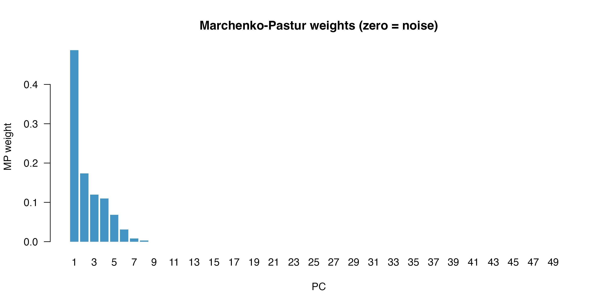

# Variance-Weighted UMAP with wUMAP

## Overview

Standard UMAP treats every principal component (PC) equally. In
scRNA-seq, early PCs capture far more biological variation than later
ones — yet a standard UMAP over PCs 1–50 weights PC 50 the same as PC 1.

**wUMAP** scales each PC axis by a weight derived from its variance
contribution before handing the embedding to UMAP, so biologically
informative PCs dominate cell distances in the final layout.

## Setup

``` r

library(Seurat)
library(SeuratData)
library(ggplot2)
library(wUMAP)
library(patchwork)
```

## Data

We use the classic PBMC 3k dataset from `SeuratData`, which includes
PCA, cell-type annotations, and standard clustering already applied.

``` r

data(pbmc3k.final)
pbmc <- UpdateSeuratObject(pbmc3k.final)
Idents(pbmc) <- "seurat_annotations"
```

## Standard vs weighted UMAP

[`RunWeightedUMAP()`](https://lachland.github.io/weightedUMAP/reference/RunWeightedUMAP.md)
is a drop-in replacement for
[`RunUMAP()`](https://satijalab.org/seurat/reference/RunUMAP.html).
Setting `weight.by = "none"` reproduces the standard result;
`weight.by = "prop.var"` (the default) scales each PC by its proportion
of explained variance.

``` r

set.seed(42)
pbmc <- RunWeightedUMAP(pbmc, dims = 1:50, weight.by = "none",
                        reduction.name = "umap.std",     verbose = FALSE)

pbmc <- RunWeightedUMAP(pbmc, dims = 1:50, weight.by = "prop.var",
                        reduction.name = "umap.wt",      verbose = FALSE)
```

``` r

p1 <- DimPlot(pbmc, reduction = "umap.std", label = TRUE, repel = TRUE) +
  ggtitle("Standard UMAP") + NoLegend()
p2 <- DimPlot(pbmc, reduction = "umap.wt",  label = TRUE, repel = TRUE) +
  ggtitle("Weighted UMAP (prop.var)") + NoLegend()
p1 | p2
```


Left: standard UMAP. Right: variance-weighted UMAP.

## Weighting schemes

Three schemes are available via `weight.by`:

| Value | Weight formula | Effect |
|----|----|----|
| `"prop.var"` | $`w_i = \sigma_i^2 / \sum \sigma^2`$ | Early PCs strongly dominate |
| `"stdev"` | $`w_i = \sigma_i / \sum \sigma`$ | Gentler emphasis on early PCs |
| `"mp"` | $`w_i = \max(0,\,\sigma_i^2 - \lambda_{\max})`$ normalised | Keeps only PCs above the Marchenko–Pastur noise floor |
| `"none"` | $`w_i = 1/d`$ | Standard UMAP |

The `"mp"` option applies the **Marchenko–Pastur** (MP) law from random
matrix theory to determine which PCs carry signal above the noise floor.
Given $`n`$ cells and $`p`$ features, the theoretical noise ceiling is
``` math
\lambda_{\max} = \left(1 + \sqrt{\frac{p}{n}}\right)^2
```
Only PCs whose variance $`\sigma_i^2 > \lambda_{\max}`$ receive non-zero
weight; all others are treated as noise and zeroed out. If no PC clears
the threshold (e.g. on tiny datasets) the function falls back to
`"prop.var"` with a warning.

``` r

pbmc <- RunWeightedUMAP(pbmc, dims = 1:50, weight.by = "stdev",
                        reduction.name = "umap.wt.sd", verbose = FALSE)
```

``` r

p3 <- DimPlot(pbmc, reduction = "umap.wt.sd", label = TRUE, repel = TRUE) +
  ggtitle("Weighted UMAP (stdev)") + NoLegend()
p2 | p3
```


Proportional-variance vs standard-deviation weighting.

## Marchenko–Pastur weighting

`weight.by = "mp"` uses random matrix theory to identify PCs that carry
genuine signal above the noise floor predicted for a random matrix of
the same dimensions. Only those PCs receive non-zero weight.

``` r

pbmc <- RunWeightedUMAP(pbmc, dims = 1:50, weight.by = "mp",
                        reduction.name = "umap.mp", verbose = FALSE)
```

We can inspect how many PCs were retained (non-zero weight):

``` r

mp_weights <- Misc(pbmc[["umap.mp"]])$weights
cat(sprintf("%d / %d PCs above noise floor (non-zero weight)\n",
            sum(mp_weights > 0), length(mp_weights)))
#> 8 / 50 PCs above noise floor (non-zero weight)
barplot(mp_weights, names.arg = seq_along(mp_weights),
        xlab = "PC", ylab = "MP weight",
        main = "Marchenko-Pastur weights (zero = noise)",
        col = ifelse(mp_weights > 0, "#4393C3", "#D1D1D1"),
        border = NA, las = 1)
```



``` r

p_mp <- DimPlot(pbmc, reduction = "umap.mp", label = TRUE, repel = TRUE) +
  ggtitle("Weighted UMAP (mp)") + NoLegend()
p2 | p_mp
```


MP weighting vs proportional-variance weighting.

## Blending with `weight.factor`

`weight.factor` (0–1) continuously blends between the unweighted (`0`)
and fully weighted (`1`) embedding:

``` r

pbmc <- RunWeightedUMAP(pbmc, dims = 1:50, weight.by = "prop.var",
                        weight.factor = 0.25, reduction.name = "umap.wf25",
                        verbose = FALSE)
pbmc <- RunWeightedUMAP(pbmc, dims = 1:50, weight.by = "prop.var",
                        weight.factor = 0.75, reduction.name = "umap.wf75",
                        verbose = FALSE)
```

``` r

pa <- DimPlot(pbmc, reduction = "umap.std",  label = TRUE, repel = TRUE) +
  ggtitle("weight.factor = 0") + NoLegend()
pb <- DimPlot(pbmc, reduction = "umap.wf25", label = TRUE, repel = TRUE) +
  ggtitle("weight.factor = 0.25") + NoLegend()
pc <- DimPlot(pbmc, reduction = "umap.wf75", label = TRUE, repel = TRUE) +
  ggtitle("weight.factor = 0.75") + NoLegend()
pd <- DimPlot(pbmc, reduction = "umap.wt",   label = TRUE, repel = TRUE) +
  ggtitle("weight.factor = 1") + NoLegend()
(pa | pb) / (pc | pd)
```


weight.factor controls the blend between standard and fully weighted.

## Log-scale weights

For datasets where PC 1 explains dramatically more variance than all
others, `log.scale = TRUE` first applies
[`log1p()`](https://rdrr.io/r/base/Log.html) to the weights before
normalising. This compresses the dynamic range so intermediate PCs still
contribute to the layout.

``` r

pbmc <- RunWeightedUMAP(pbmc, dims = 1:50, weight.by = "prop.var",
                        log.scale = TRUE, reduction.name = "umap.log",
                        verbose = FALSE)
```

``` r

DimPlot(pbmc, reduction = "umap.std", label = TRUE, repel = TRUE) + ggtitle("Standard") + NoLegend() |
DimPlot(pbmc, reduction = "umap.wt",  label = TRUE, repel = TRUE) + ggtitle("prop.var") + NoLegend() |
DimPlot(pbmc, reduction = "umap.log", label = TRUE, repel = TRUE) + ggtitle("prop.var + log.scale") + NoLegend()
```


Standard (left), fully weighted (centre), log-scaled weights (right).

## Consistent clustering and UMAP with `RunWeightedNeighbors()`

A common pitfall: clustering on one KNN graph while visualising on
another.
[`RunWeightedNeighbors()`](https://lachland.github.io/weightedUMAP/reference/RunWeightedNeighbors.md)
stores the weighted embedding and builds both the KNN and SNN graphs in
one step, so clustering and UMAP share *exactly* the same
nearest-neighbour structure.

``` r

pbmc <- RunWeightedNeighbors(pbmc, dims = 1:50, weight.by = "prop.var",
                             prefix = "wt", verbose = FALSE)

pbmc <- FindClusters(pbmc, graph.name = "wt_snn", resolution = 0.5,
                     verbose = FALSE)

pbmc <- RunWeightedUMAP(pbmc, graph = "wt_nn", reduction.name = "umap.consistent",
                        verbose = FALSE)
```

``` r

DimPlot(pbmc, reduction = "umap.consistent", label = TRUE, repel = TRUE) +
  ggtitle("Consistent weighted clustering + UMAP") + NoLegend()
```


Clustering and UMAP both derived from the same weighted KNN graph.

## Local PCA UMAP

[`RunLocalPCAUMAP()`](https://lachland.github.io/weightedUMAP/reference/RunLocalPCAUMAP.md)
is a more principled alternative to global variance weighting. Rather
than rescaling PC axes globally, it measures the distance between every
pair of neighbours in a **locally-fitted PCA basis** — capturing the
predominant direction of variation in each cell’s neighbourhood
(e.g. the tangent of a trajectory) and de-emphasising transverse noise.

**Algorithm:**

1.  Find the global $`k`$ nearest neighbours of every cell in PCA space
    (RANN).
2.  For each cell $`i`$, centre its $`k`$-neighbourhood and compute a
    compact SVD.
3.  Re-express displacement vectors to neighbours in the local
    `local.dims` principal directions.
4.  Report the Euclidean norm in that local basis as the refined
    distance.
5.  Pass the $`n \times k`$ index/distance matrix directly to
    [`uwot::umap`](https://jlmelville.github.io/uwot/reference/umap.html)
    as a precomputed k-NN graph.

``` r

set.seed(42)
pbmc <- RunLocalPCAUMAP(pbmc, dims = 1:30, k.param = 30,
                        reduction.name = "lp.umap", verbose = FALSE)
```

``` r

p_std <- DimPlot(pbmc, reduction = "umap.std",  label = TRUE, repel = TRUE) +
  ggtitle("Standard UMAP") + NoLegend()
p_lp  <- DimPlot(pbmc, reduction = "lp.umap",   label = TRUE, repel = TRUE) +
  ggtitle("Local PCA UMAP") + NoLegend()
p_std | p_lp
```


Standard UMAP (left) vs local PCA UMAP (right).

The local PCA approach can reveal trajectory-like structure that is
compressed in standard UMAP because the distance metric is insensitive
to the predominant local direction of variation.

## Further reading

For a quantitative evaluation of all weighting schemes (including `"mp"`
and `RunLocalPCAUMAP`) against an independent protein-based ground truth
(cbmc CITE-seq), see the
[Benchmark](https://lachland.github.io/weightedUMAP/articles/benchmark.md)
article.
